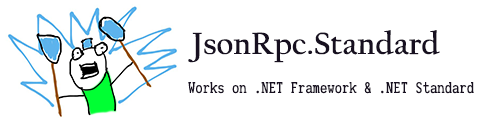

# JsonRpc.Standard

[](https://gitter.im/CXuesong/JsonRpc.Standard?utm_source=badge&utm_medium=badge&utm_campaign=pr-badge)

An asynchronous .NET Standard 1.3 & .NET Framework 4.5 library for JSON RPC client & server implementation. The package focuses on the implementation of [JSON RPC 2.0](http://www.jsonrpc.org/specification), while 1.0 support might be offered in the future.

The `CXuesong.JsonRpc.*` packages are now available on NuGet. To decide which package(s) you should install, please refer to the [topic page on repository wiki](https://github.com/CXuesong/JsonRpc.Standard/wiki/The-NuGet-packages). For example, you may install the `CXuesong.JsonRpc.Commons` package with the following command

```powershell
#  Package Management Console
Install-Package CXuesong.JsonRpc.Commons
# .NET CLI
dotnet add package CXuesong.JsonRpc.Commons
```

| Package                                                      | Status                                                       |
| ------------------------------------------------------------ | ------------------------------------------------------------ |
| ~~[CXuesong.JsonRpc.Standard](https://www.nuget.org/packages/CXuesong.JsonRpc.Standard)~~ <br />Superseded by CXuesong.JsonRpc.Commons |   |
| [CXuesong.JsonRpc.Commons](https://www.nuget.org/packages/CXuesong.JsonRpc.Commons) |   |
| [CXuesong.JsonRpc.DynamicProxy](https://www.nuget.org/packages/CXuesong.JsonRpc.DynamicProxy) |   |
| [CXuesong.JsonRpc.Streams](https://www.nuget.org/packages/CXuesong.JsonRpc.Streams) |   |
| [CXuesong.JsonRpc.AspNetCore](https://www.nuget.org/packages/CXuesong.JsonRpc.AspNetCore) |   |
| [CXuesong.JsonRpc.Http](https://www.nuget.org/packages/CXuesong.JsonRpc.Http) |   |
| [CXuesong.JsonRpc.WebSockets](https://www.nuget.org/packages/CXuesong.JsonRpc.WebSockets) |   |

For a walkthrough of the packages, see [repository wiki](https://github.com/CXuesong/JsonRpc.Standard/wiki). For complete documentation on the classes, see [library reference](<https://cxuesong.github.io/JsonRpc.Standard>).

## Examples

For an example based on `FullDuplexStream`, please dive into `ConsoleTestApp`. 

For an example JSON-RPC server over HTTP with WebSocket support set up on ASP.NET Core, see `WebTestApplication`.

For the (WIP) implementation of [Mircosoft Language Server Protocol](https://github.com/Microsoft/language-server-protocol/blob/master/protocol.md) on the top of this library, please take a look at [CXuesong/LanguageServer.NET](https://github.com/CXuesong/LanguageServer.NET). And a step further, for a WIP [Wikitext](https://en.wikipedia.org/wiki/Wiki_markup) language server, please take a look at [CXuesong/MwLanguageServer](https://github.com/CXuesong/MwLanguageServer).

